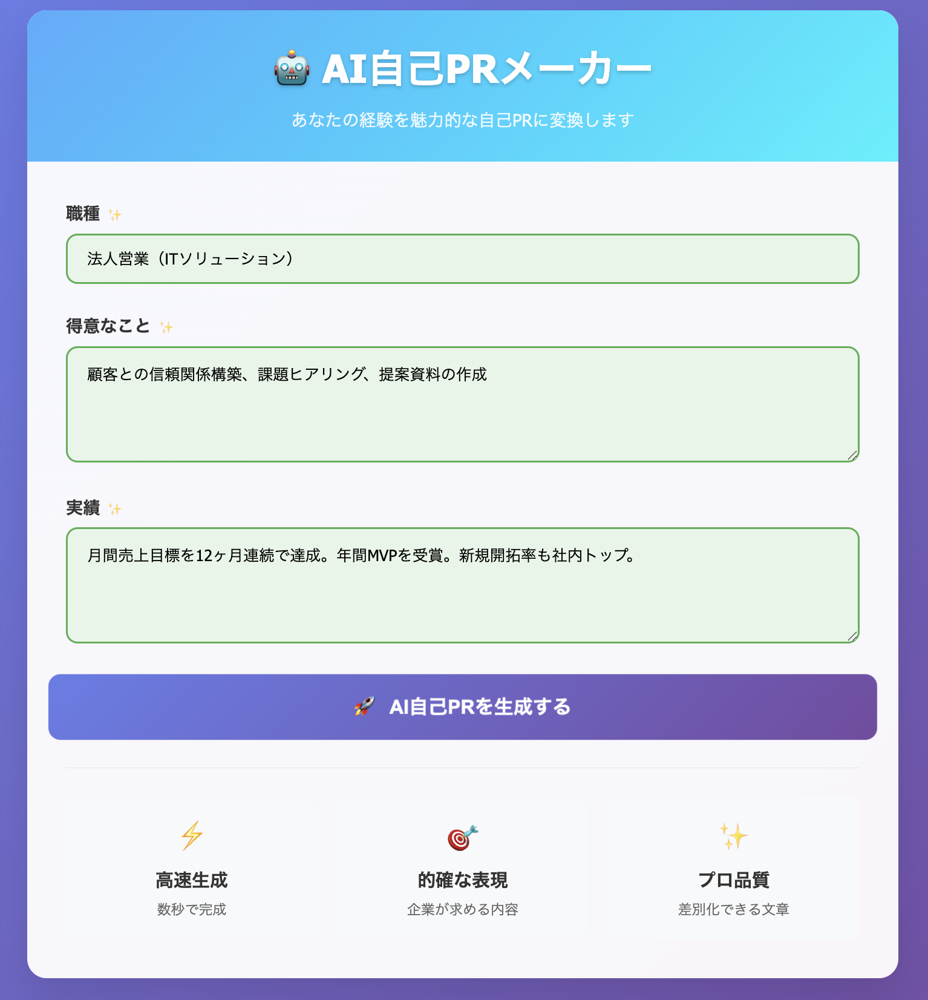
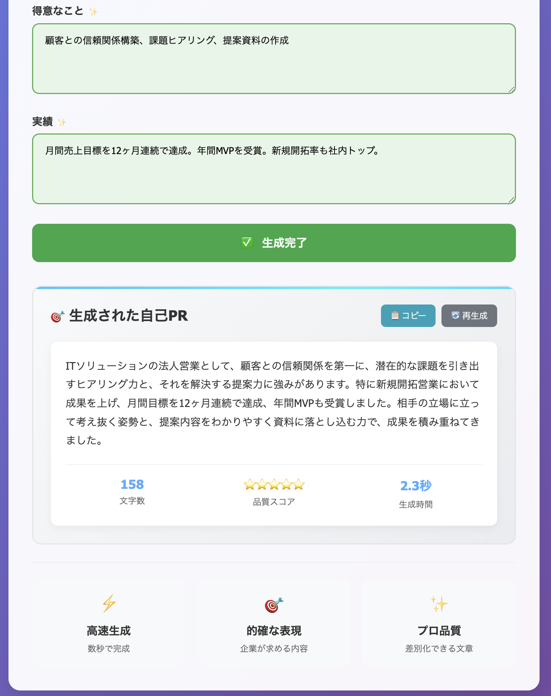

# AI自己PRメーカー

## 概要

**AI自己PRメーカー**は、転職活動中の方向けに、AIがあなたの経歴や強みをもとに「自己PR文」を自動で作成してくれるWebアプリです。

履歴書や職務経歴書、転職サイトのプロフィール欄などで使える「伝わる文章」がすぐに作れます。

## 対象ユーザー

- 初めて転職活動をする人
- 自己PR文の書き方がわからない人
- 伝えたい強みはあるけれど、うまく言語化できない人
- 時間をかけずに質の高い文章を作成したい人

## ユーザーの課題・困りごと

- 自己PRがうまく書けずに何時間も悩んでしまう
- テンプレートっぽい文章になりがち
- 自分の強みをどう表現すればいいか迷う
- 転職エージェントに頼る前に、自分でも試してみたい

## このアプリでできること

- 経験職種や得意なことを入力するだけで、AIが自然な自己PR文を生成！
- ビジネスシーンに適した表現で、魅力的にアピールできる
- 書き直しや複数パターンの生成も可能
- ブラウザ上で動くので、スマホやPCで手軽に使える

## 使用技術

| 項目         | 技術                             |
|--------------|----------------------------------|
| フロントエンド | Streamlit |
| バックエンド   | Python（Streamlit）   |
| AIモデル      | OpenAI GPT-4 / GPT-4o API        |
| その他        | Streamlit Community Cloud |

## 使い方

1. アプリを開く  
2. 「職種」「得意なこと」「実績」などを入力  
3. 「自己PRをつくる」ボタンをクリック  
4. AIが最適な自己PR文を自動で作成！そのままコピーして使えます

## 画面

### 入力画面  
例：  
| 項目    | 入力内容                                   |
| ----- | -------------------------------------- |
| 職種    | 法人営業（ITソリューション）                        |
| 得意なこと | 顧客との信頼関係構築、課題ヒアリング、提案資料の作成             |
| 実績    | 月間売上目標を12ヶ月連続で達成。年間MVPを受賞。新規開拓率も社内トップ。 |

| 項目    | 入力内容                                   |
| ----- | -------------------------------------- |
| 職種    | Webアプリケーションエンジニア（Python / JavaScript）  |
| 得意なこと | フロントからバックエンドまでの開発、要件整理、チームでの開発         |
| 実績    | 自社の予約管理システムを3ヶ月でフルリプレイス。パフォーマンスを2倍に改善。 |

| 項目    | 入力内容                                |
| ----- | ----------------------------------- |
| 職種    | 人事・採用担当                             |
| 得意なこと | 社内調整、業務フロー改善、候補者対応、説明会運営            |
| 実績    | 採用歩留まりを30%改善。人事制度の見直しにも中心メンバーとして関与。 |

 

---

### 出力結果（例）  
> チームの成果を最優先に考え、常に現場との対話を重ねながらプロジェクトを推進してきました。課題発見から改善提案までを一貫して担う姿勢が評価され、...

## 注意点

- OpenAIのAPIキーが必要です（無料枠あり）
- 個人情報は入力しないようご注意ください
- 商用利用を行う場合は、利用規約をご確認ください

